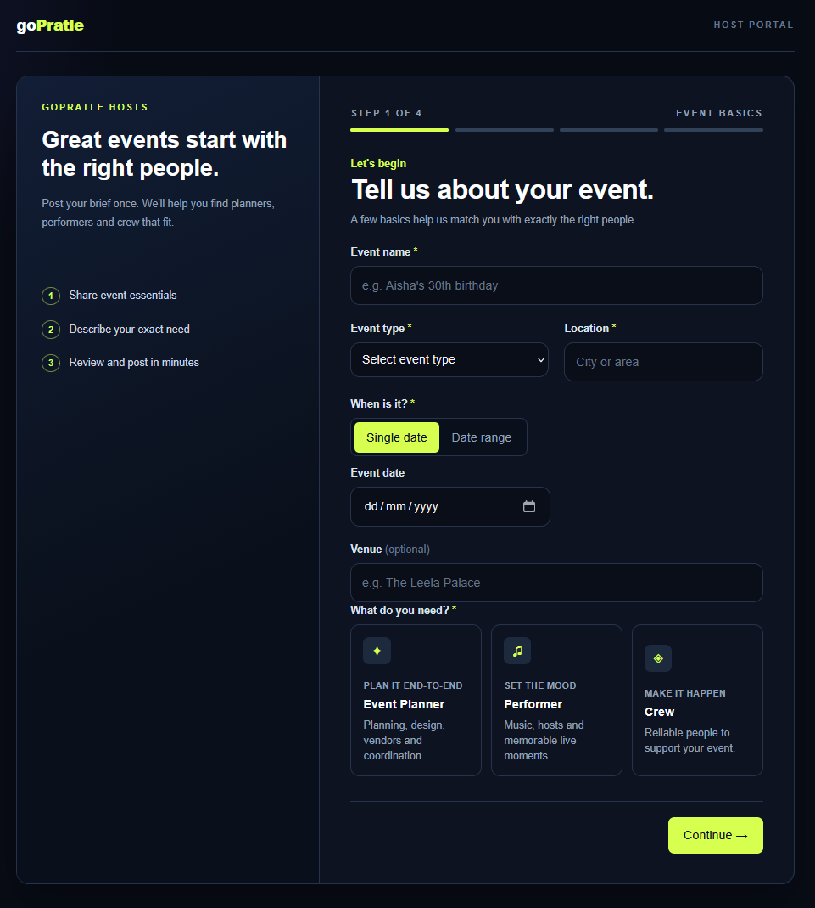
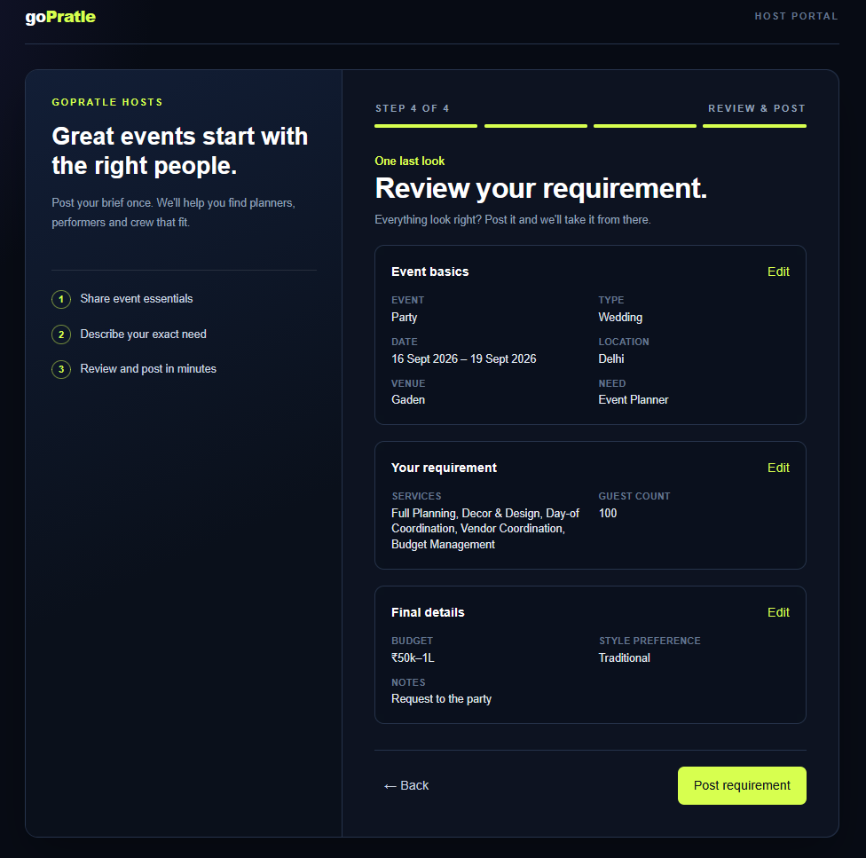
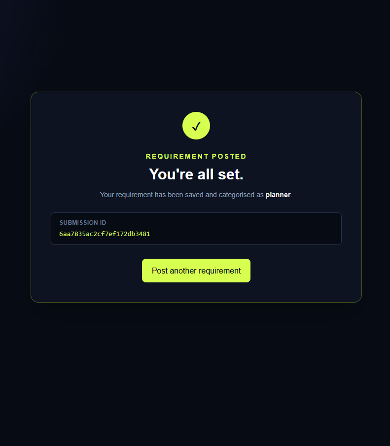

# GoPratle Requirement Posting Flow

[](https://nextjs.org/)
[](https://react.dev/)
[](https://www.typescriptlang.org/)
[](https://tailwindcss.com/)
[](https://react-hook-form.com/)
[](https://zod.dev/)
[](https://axios-http.com/)
[](https://nodejs.org/)
[](https://expressjs.com/)
[](https://mongoosejs.com/)
[](https://www.mongodb.com/atlas)
[](https://www.netlify.com/)
[](https://render.com/)

A full-stack requirement posting flow for event hosts. Users can describe an event, choose whether they need an **Event Planner**, **Performer**, or **Crew**, review the details, and submit the requirement to MongoDB.

## Live Demo

- **Frontend:** [gopratles.netlify.app](https://gopratles.netlify.app/post-requirement?step=1)
- **Backend health:** [gopratle-s8ge.onrender.com/api/health](https://gopratle-s8ge.onrender.com/api/health)

The deployed API health check returns:

```json
{
   "success": true,
   "status": "ok"
}
```

## Screenshots

### Homepage / Event Basics



### Details and Review Page



### Successful Submission Page



## Features

- Four-step requirement wizard with URL-driven navigation
- Event basics: name, type, date or date range, location, and venue
- Category-specific forms for planners, performers, and crew
- Client-side validation with Zod and React Hook Form
- Server-side validation with Mongoose schemas
- Review screen before submission
- Submission confirmation with the created MongoDB document ID
- REST API with health, create, list, filter, and detail endpoints
- Mongoose discriminators in one shared `requirements` collection
- Responsive dark host-portal interface

## Technology Stack

### Frontend

- Next.js 16 App Router
- React 19
- TypeScript
- Tailwind CSS 4
- React Hook Form
- Zod
- Axios

### Backend

- Node.js
- Express 5
- Mongoose 8
- MongoDB Atlas
- CORS
- dotenv

### Deployment and tooling

- Netlify for the Next.js frontend
- Render for the Express API
- GitHub for source control and continuous deployment
- npm workspaces for the monorepo
- Node.js built-in test runner for backend tests

## Project Structure

```text
.
├── backend/
│   ├── src/
│   │   ├── config/           # MongoDB connection
│   │   ├── controllers/      # Requirement request handlers
│   │   ├── models/           # Base model and category discriminators
│   │   └── routes/           # Express API routes
│   └── test/                 # Backend validation tests
├── frontend/
│   ├── app/                  # Next.js routes and global styles
│   ├── components/wizard/    # Wizard steps and shared UI
│   └── lib/                  # API client, types, and validation
├── homepage.png              # Event basics screenshot
├── details-page.png          # Review screenshot
├── submit-page.png           # Successful submission screenshot
├── netlify.toml              # Netlify build configuration
└── render.yaml               # Render backend configuration
```

## Local Development

### Requirements

- Node.js 20.9 or newer
- npm
- MongoDB Atlas account or a local MongoDB instance

### Install

```bash
npm install
```

Create `backend/.env` from `backend/.env.example`:

```env
MONGODB_URI=mongodb+srv://<username>:<password>@<cluster>/<database>?retryWrites=true&w=majority
CORS_ORIGIN=http://localhost:3000
PORT=5000
```

Create `frontend/.env.local` from `frontend/.env.local.example`:

```env
NEXT_PUBLIC_API_URL=http://localhost:5000/api
```

Environment files are ignored by Git. Never commit real credentials or connection strings.

### Run the applications

```bash
npm run dev
```

- Frontend: `http://localhost:3000/post-requirement?step=1`
- Backend: `http://localhost:5000`

## API

| Method | Endpoint | Purpose |
| --- | --- | --- |
| `GET` | `/api/health` | Check API availability |
| `POST` | `/api/requirements` | Create a planner, performer, or crew requirement |
| `GET` | `/api/requirements` | List requirements, newest first |
| `GET` | `/api/requirements?category=performer` | Filter requirements by category |
| `GET` | `/api/requirements/:id` | Retrieve one requirement |

Quick health check:

```bash
curl http://localhost:5000/api/health
```

## Tests and Verification

Backend tests cover the Mongoose discriminator models and category-specific validation rules.

```bash
npm test
```

Result:

```text
ℹ tests 3
ℹ pass 3
ℹ fail 0
```

Build the production frontend:

```bash
npm run build
```

The production build completes successfully with TypeScript checking and static route generation.

## Deployment

### MongoDB Atlas

1. Create a MongoDB Atlas cluster and database user.
2. Add the deployment network access required by Render.
3. Add the Atlas connection string to Render as `MONGODB_URI`.

### Render API

The included `render.yaml` configures the backend service. For a manual Render service, use:

```text
Root directory: backend
Build command: npm install
Start command: npm start
```

Set these Render environment variables:

```env
MONGODB_URI=<your MongoDB Atlas connection string>
CORS_ORIGIN=https://gopratles.netlify.app
```

Do not set `CORS_ORIGIN` to the frontend path or include `/api`. Render supplies `PORT` automatically.

### Netlify frontend

The included `netlify.toml` builds the frontend workspace from the repository root. Set this Netlify environment variable for the production context:

```env
NEXT_PUBLIC_API_URL=https://gopratle-s8ge.onrender.com/api
```

Redeploy after changing this value because `NEXT_PUBLIC_*` variables are compiled into the browser bundle.

## Security

- Real `.env` and `.env.local` files are ignored by Git.
- Local `AGENTS.md`, `CLAUDE.md`, and the PRD are ignored as repository-local files.
- Never expose `MONGODB_URI` in screenshots, commits, logs, or public documentation.
- Rotate the MongoDB password immediately if the connection string is exposed.
